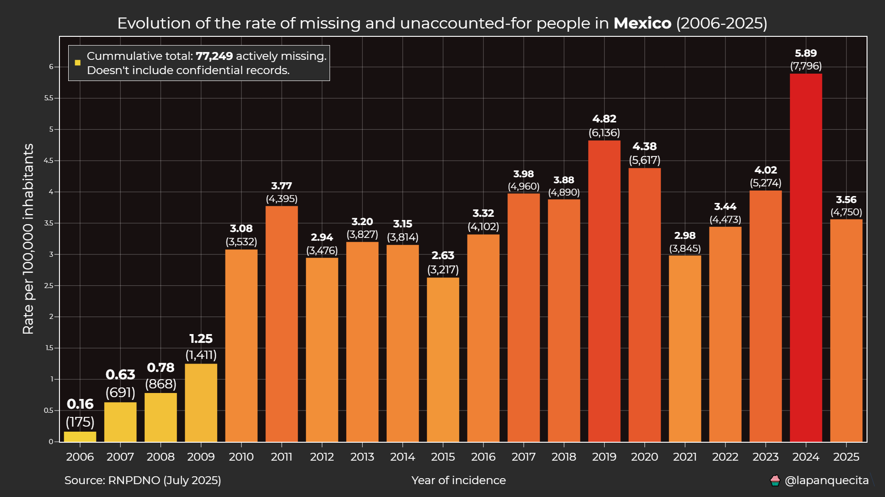
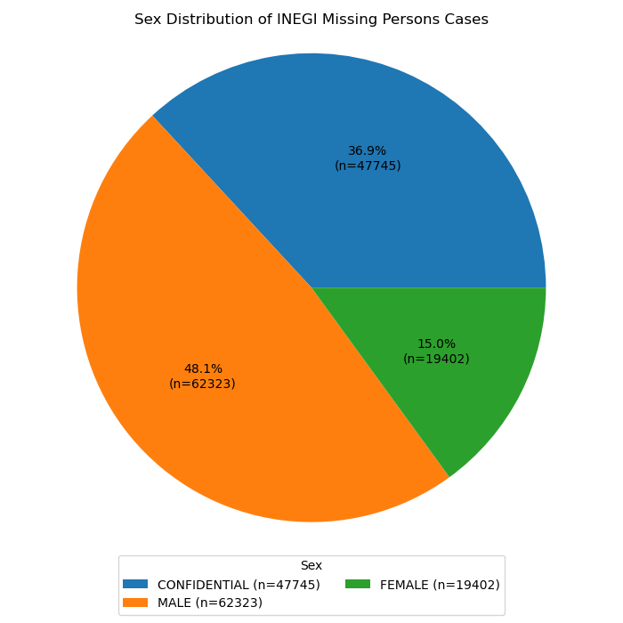
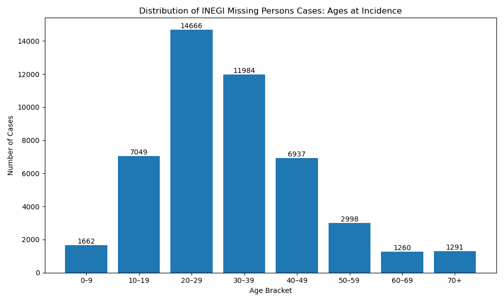

# Scaling of Missing Persons, International Comparisons, Time-series,...

## Ayush Sarkar | 7/12/2025 – 8/06/2025 | Missing Persons w/ Dynamical Systems Lab @ NYU

---

## TL;DR

This project measures how the number of missing persons cases reported in a place grows with the population of that place — and finds that the answer is structurally different between the United States and Mexico.

- **United States (NamUs, 1969–2024, N = 25,532 cleaned cases):** the scaling is **sublinear-to-near-linear** (β ≈ 0.75–1.0 depending on the geographic level) with tight R² (> 0.85 at State/CSA), and stable over time.
- **Mexico (INEGI, 2006–2025, N = 129,830 raw / ~77k after censorship removal):** the scaling is mildly **superlinear** (β ≈ 1.11, 95% CI [0.66, 1.57]) and the *per-capita rate* has climbed ~37× in twenty years (0.16 → 5.89 per 100,000 inhabitants).

Read on for the figures, the methodology, the caveats, and the data sources. The reproducible pipeline lives in [`mp.ipynb`](mp.ipynb); the standalone scripts live in [`scripts/`](scripts/). All raw data inputs are catalogued in the [Data sources](#data-sources) section.

---

## Table of Contents

1. [Why this project exists](#why-this-project-exists)
2. [Why Mexico specifically?](#why-mexico-specifically)
3. [The scaling framework in one paragraph](#the-scaling-framework-in-one-paragraph)
4. [Data at a glance](#data-at-a-glance)
5. [Headline findings](#headline-findings)
6. [Deeper look — United States (NamUs)](#deeper-look--united-states-namus)
7. [Deeper look — Mexico (INEGI)](#deeper-look--mexico-inegi)
8. [Comparison: U.S. vs Mexico](#comparison-us-vs-mexico)
9. [Caveats & limitations](#caveats--limitations)
10. [Significance & future directions](#significance--future-directions)
11. [Methodology summary](#methodology-summary)
12. [Repository layout](#repository-layout)
13. [Reproducing the pipeline](#reproducing-the-pipeline)
14. [Data sources](#data-sources)
15. [Acknowledgments](#acknowledgments)

---

## Why this project exists

The project grew out of an interest in **Mexico**, which is in the middle of one of the largest missing-persons crises on the planet. Most public discussion of that crisis is qualitative; very little of it puts a *number* on how the case load distributes across the country, or how that distribution compares to a country without an active crisis.

The cleanest quantitative tool for that comparison comes from the **urban scaling literature** (Bettencourt et al. 2007, 2013 — see [Data sources](#data-sources)): a wide range of socio-economic quantities — patents, GDP, crime, AIDS cases, total wages — have been shown to follow a power-law relationship with population, `Y(N) ~ N^β`. The exponent β tells you whether the per-capita rate of Y grows with city size (β > 1, superlinear), shrinks (β < 1, sublinear), or stays constant (β ≈ 1).

If we treat missing-persons reports as the *Y* quantity, we can ask: does the reporting/incidence rate scale with population in a stable way, the way patents and GDP do? Does it differ between countries? Does it drift over time? The answer to all three questions turns out to be informative, even with the messy, censorship-affected datasets we're forced to work with.

The U.S. is included as a *control case*: a country with no acute missing-persons crisis but a long-running federal database (NamUs) we can use to establish what "stable reporting" looks like. The contrast with Mexico is the part that matters.

---

## Why Mexico specifically?

Of all the countries with an ongoing missing-persons problem, Mexico is uniquely well-suited to a scaling analysis for three reasons — **public data availability**, **scale of the crisis**, and **administrative-structure compatibility with the U.S.**:

1. **Mexico publishes case-level data.** Most countries with active disappearance problems publish only aggregate counts (and many publish nothing at all). Mexico's **Comisión Nacional de Búsqueda (CNB)** maintains the **Registro Nacional de Personas Desaparecidas y No Localizadas (RNPDNO)** — a *person-level* registry that is queryable through the federal government's public portal (see [Data sources → Mexico](#mexico-used)). The figshare scrape we use is a snapshot of that registry. With person-level records you can aggregate to any geographic level you like; with aggregate-only data you're locked into the level the publisher chose.
2. **Mexico is one of the worst-affected countries in the world.** The cumulative count of missing/unaccounted-for persons in Mexico now sits above 120,000, with credible reporting suggesting the true figure is materially higher than that. The crisis traces to the start of the Mexican drug war in **December 2006** and has accelerated through several presidential administrations; advocacy organizations like **Movimiento por Nuestros Desaparecidos en México (MNDM)** have documented systematic patterns of forced disappearance, often tied to organized crime and at times to state actors (see [Data sources](#data-sources) for primary sources). The crisis is large enough that a scaling regression has the statistical power to detect structural patterns.
3. **The administrative structure maps cleanly onto the U.S.** Mexico is divided into 31 states plus Mexico City (CDMX), each with municipalities below them — a two-level hierarchy that mirrors the U.S. state → county hierarchy closely enough that the same log–log regression can be applied to both without exotic re-binning. (The CBSA layer is U.S.-specific, but the State and county/municipality layers translate directly.)

### What about other countries?

We did look at several others before settling on Mexico as the comparison case:

- **Colombia** — SIEDCO (national police) releases department-level case counts but not person-level records. The dynamic range in department-population is also narrow (32 departments), which would have made the regression underpowered. The data quality looked best on paper but ultimately wasn't granular enough.
- **Brazil** — there is no consolidated national missing-persons registry. Some state-level data exists, but the only published numbers in the academic literature treat missing persons as a *sub-category* of forced disappearance rather than as a class of their own (see Sciencedirect 2022 article in [Data sources](#data-sources)).
- **Argentina** — Personas Perdidas (NGO) and SIFEBU (federal government) release management reports rather than queryable records. The 2024 SIFEBU report has aggregate counts but not the case-by-case data you'd need.
- **India** — has one of the highest absolute counts globally, but case data lives across ~28 separate state police systems with no unified federal release.
- **El Salvador, Guatemala, Honduras** — Northern Triangle countries with high incidence but minimal public data.

So Mexico ended up being the only country where *(case-level data, large N, comparable admin structure)* all hold simultaneously. The other countries are listed in the [Considered but not used](#considered-but-not-used-data-quality--accessibility-issues) sub-section of Data sources so future iterations of this project can revisit them as their data ecosystems mature.

---

## The scaling framework in one paragraph

For every geographic unit *u* (county, MSA, CSA, state) and every choice of time window, we count the number of reported missing-persons cases in *u* and pair it with *u*'s population in that window. We then fit a single ordinary-least-squares line in log space:

```
log10(cases_u) = γ + β · log10(pop_u)
```

The exponent **β** is the scaling exponent. The intercept **γ** absorbs everything else (overall reporting intensity, year-of-disappearance baseline, etc.). The fit is repeated at multiple geographic levels because β can change as you change the unit of analysis — a country can be sublinear at the state level but linear at the CBSA level, or vice versa, and the comparison is informative.

When we do this *per year* instead of cumulatively, we get a time series β(t) that diagnoses whether the reporting regime is *stable* (flat β) or *shifting* (drifting β).

---

## Data at a glance

| | **NamUs (US)** | **INEGI / RNPDNO (Mexico)** |
|--|---------------|--------------------|
| Type | Voluntary federal registry | National-government registry (CNB) |
| Window covered | 1902–2025 (we use 1969–2024) | 1960s–2025 (we use 2006–2025) |
| Raw N | ~25,630 | 129,830 |
| Clean N | **25,532** | ~77,249 (excludes ~37% confidential) |
| Spatial granularity | County → MSA → CSA → State | Municipality → State (municipality often missing) |
| Per-column missingness | Low (<5% on key fields) | High: 43% on DATE_OF_INCIDENCE, 41% on MUNICIPALITY |
| Snapshot date | 2025-07-17 | 2025-07-02 (figshare v4) |
| Population source | SEER (1969–2022) + Census 2024 vintage | INEGI Población 2020–2070 projections |
| Crosswalk source | BLS QCEW, 3 historical vintages | n/a (state-level analysis only) |

The asymmetry on the right column is what shapes the rest of the analysis: NamUs is small but clean, INEGI is large but heavily censored. We let each dataset dictate the questions it can answer.

For the underlying data files and how to download them, see the [Data sources](#data-sources) section at the bottom of this README.

---

## Headline findings

1. **U.S. cumulative β is sublinear-to-near-linear at every aggregation level.** Across States, Counties, CSAs, and CBSAs over 1969–2024, β sits in a narrow band roughly between **0.75 and 1.0**. The tightest fits (R² > 0.85) are at the State and CSA levels. Interpretation: bigger U.S. places report proportionally *slightly fewer* cases per capita than smaller ones — consistent with a reporting-driven signal where small jurisdictions flag long-term missing persons to NamUs while large jurisdictions resolve more cases in-house.
2. **U.S. β(t) is stable post-2000.** Annual β(t) fits at the state level sit roughly between 0.4 and 1.0 with 95% CIs that collapse markedly around the year 2000, when NamUs reporting normalizes. Pre-1990 fits are noisy from sparse N; post-2005 fits are uniformly tight (R² > 0.7 in nearly every year). The interpretation is that the geographic distribution of NamUs reporting has reached a steady state.
3. **Mexico's per-100k rate has climbed ~37× in twenty years.** From **0.16 per 100,000** in 2006 to **5.89 per 100,000** in 2024, with a clear regime-shift around 2010 — the years following the most violent phase of the Mexican drug war. The curve has never returned to pre-2010 levels.
4. **Mexico's cumulative β is mildly superlinear (β ≈ 1.11).** With 95% CI [0.66, 1.57] and R² = 0.455 the point estimate alone is not strong evidence against per-capita scaling, but combined with the rising γ(t) it's the formal signature of a country in active crisis rather than stable reporting.

---

## Deeper look — United States (NamUs)

### Cumulative scaling regression [1969–2024]

The six-panel figure below fits β at every available aggregation level — States, Counties, CSAs, all CBSAs, MSAs only, and MicroSAs only — on the cumulative case totals over 1969–2024. State and CSA panels show the tightest fits; the MicroSA panel is the noisiest because the dynamic range in MicroSA populations is narrow (10k–50k cores) and many MicroSAs report fewer than ten cases over the entire window.


The state-level intercept γ ≈ −2 implies a normalized reporting rate around 10⁻² cases per person across 55 years, which is the right order of magnitude for a voluntary registry.

### Same regression at narrower windows

Restricting to 2000–2024 and 2010–2024 lets us see whether the scaling is stable as we zoom in on the modern reporting era. It is — β shifts only slightly across the three windows, which is the cleanest evidence we have that the bulk scaling is a structural property of the U.S. reporting system rather than a historical artifact. (Compare to the 1969–2024 figure directly above: the panels look almost identical apart from the absolute case counts.)

| Window | Figure |
|--------|--------|
| 2000–2024 |  |
| 2010–2024 |  |

### β over time — States (annual, 1969–2024)

Each point is the State-level β refit on only the cases reported in that year, with 95% CI error bars. The pre-1990 era is noisy because NamUs holds very few annual records that far back; CIs collapse around 2000 as participation normalizes. The post-2000 band sits between roughly 0.4 and 1.0 — a wide band but stable in level, not drifting.


The best-vs-worst-fit comparison below shows the same idea at a glance: the worst-R² year is dominated by a single high-leverage state, while the best-R² year shows a tight log-linear cloud across all 50 states.


And the R²(t) trace confirms the rest:


### β over time at finer aggregation levels

The annual β series also exists at County, CBSA, MSA, MicroSA, and CSA levels — included here because the State-level series above can hide whether the same stability holds when we zoom in. (It does, mostly.)

**Counties** are the noisiest aggregation level because every year sees ~3,000 counties of which only a few hundred carry cases — the regression is dominated by zero-inflation and the leverage of large-population counties (Los Angeles, Cook, Harris). The β estimate sits in a similar band to the state-level fit but with substantially wider CIs:


**CBSAs** (MSAs + MicroSAs combined) sit in between: the dynamic range in CBSA population is wider than State-level (a 5-county MSA dwarfs Wyoming), but every year has on the order of ~900 CBSAs of which a few hundred carry annual cases. The β(t) shape echoes the state-level series but with slightly tighter CIs in the modern era:


**MSAs only** (CBSAs with ≥50k core) is the cleanest finer-aggregation fit because we restrict to large metros where the case count is rarely zero. β(t) here is the most stable of all the finer levels — useful as a cross-check on the state-level series above:


The takeaway across all four β(t) figures (State, County, CBSA, MSA): the *level* of β shifts modestly with the aggregation choice — that's expected, since changing the unit of analysis changes which scale of variation dominates the regression — but the *stability over time* is the same story at every level. Once we get past the sparse-data era (pre-2000) the U.S. reporting system has been in a steady state.

### Cumulative monthly case curve

Below is the County-level cumulative-cases curve over 1969–2024, which gives a clean monthly view of how the database grew. The slope is the *reporting rate*; visible kinks in the curve usually correspond to NamUs intake-policy changes or new state participation rather than real shifts in the underlying disappearance rate. The post-2010 era is roughly linear, which is the time-domain version of "β has stabilized" from the regression figures above.


### County-level choropleth of cumulative NamUs cases

Log color scale because the case distribution is heavy-tailed; without log scaling, Los Angeles County alone would push every other county to a single shade. Alaska, Hawaii, and Puerto Rico are excluded so the bounding box stays focused on the continental U.S. — AK and HI distort the map, and PR doesn't have a SEER population panel (see [Data sources → Census & Population](#census--population-data)).

Three time windows, same projection, same color scale family — comparing them shows whether modern reporting (2010–2024) draws a meaningfully different spatial pattern than the long-window cumulative view (1969–2024). It largely doesn't: the same border / I-5 / I-10 / Atlantic-corridor structure is visible in all three, which is more evidence that the geographic *distribution* of reporting has stabilized.

| Window | Figure |
|--------|--------|
| 1969–2024 |  |
| 2000–2024 |  |
| 2010–2024 |  |

What stands out in all three windows:

- A diagonal corridor of high-case counties running from the Mexican border (Arizona / New Mexico / South Texas) northeast through the I-10 / I-35 / I-65 corridors.
- The I-5 spine in the West (San Diego → Los Angeles → Bay Area → Portland → Seattle).
- The Atlantic seaboard from D.C. through Boston.
- Comparatively *low* case density in the Great Plains and Mountain West, even after accounting for the lower population there.

The 2010–2024 view shows essentially the same pattern with sharper contrast — what we observe in the longer window is not an artifact of legacy records.

### State-level choropleth

A coarser view of the same data, useful as a sanity check that the county-level pattern isn't being driven by FIPS-resolution artifacts. The state map is mostly a population map by design — California and Texas dominate any choropleth of an absolute-count metric — but the relative spread (Florida and the border states overrepresented, Mountain West and Upper Midwest underrepresented) is the same story the county map tells.


### CBSA-type distribution

Counts of cases broken down by CBSA type — MSAs (≥50k core), MicroSAs (10k–50k core), and counties not assigned to any CBSA. MSAs carry the bulk of the case mass, which matters when reading the MicroSA panel of the cumulative scaling regression at the top of this section: a noisy MicroSA fit is partly a small-sample story, not a structural difference in how those areas scale.

.png)

### Sex distribution

The NamUs case load is roughly 2:1 male to female (65.8% / 34.2% for the 2010–2024 window after dropping records with unusable Sex). This is broadly consistent with most published missing-persons statistics in the U.S. though slightly more male-skewed than would be expected from population baselines. Compare against the [Mexican INEGI sex split](#inegi-sex-distribution) below — the Mexican male skew is even sharper.


### Ethnicity distribution

Conditional on a usable `primaryEthnicity` field. The 2010–2024 window:


| Ethnicity | NamUs share (2010–2024) | US Census share (2020, approx.) |
|-----------|-------------------------|--------------------------------|
| White / Caucasian | 45.3% | ~60% |
| Hispanic / Latino | 21.0% | ~19% |
| Black / African American | 19.0% | ~13.6% |
| Multiple | 8.3% | ~10% |
| Other | 6.4% | ~7% |

The Black / African American share at 19.0% is roughly **1.4× the underlying census share** of ~13.6% — i.e. Black Americans are overrepresented in NamUs relative to the general population. The Hispanic / Latino share at 21.0% is roughly proportional to the census Hispanic share. The White share at 45.3% is substantially *below* the census share of ~60%. These patterns are well-documented in the broader literature on demographic disparities in missing-persons reporting.

For comparison, the wider 2000–2024 window shows the same pattern with mildly different splits — White 47.5% / Hispanic 19.2% / Black 18.3%, N = 16,559 — which suggests the ethnic over- and under-representation has been stable over the modern reporting era rather than a recent phenomenon:


### Age × sex pyramid

Cumulative cases broken into Census-style age bins on the y-axis, with male on the left and female on the right. Two things to remember when reading it:

- **Current age, not age at incidence.** NamUs reports the subject's current age; a person who disappeared at 25 in 1990 and is still missing today shows up in the 55–59 bin. This is why the cumulative pyramid has a substantial middle-aged and older population that wouldn't appear if we aggregated by age-at-incidence.
- **Interval expansion.** NamUs gives an interval `[CurrentMinAge, CurrentMaxAge]` for each subject; we expand each subject into every overlapping age bin (see notebook for the rationale).


The cumulative pyramid above (1969–2024) is modal in the 40–59 *current age* range. The shorter the window we restrict to, the younger the modal age becomes, because cases haven't had as much time to "age forward". The 2010–2024 pyramid below shows the same population but with the modal bracket sitting around **35–44** instead — i.e. the more recent the window, the closer "current age" gets to "age at incidence":


Side-by-side, the two pyramids let you read off the *median latency* of unresolved NamUs cases: the gap between the modal age in the long-window pyramid (~50) and the short-window pyramid (~40) is about 10 years, which is a back-of-the-envelope estimate of how long unresolved NamUs cases stay open on average.

---

## Deeper look — Mexico (INEGI)

### Per-100k national rate, 2006–2025

This is the single most readable view of the Mexican crisis. Per-100,000 inhabitants, computed using `DATE_OF_INCIDENCE` (with `DATE_OF_REPORT` as fallback) and INEGI national population projections (see [Data sources → Mexico](#mexico-used) for the underlying figshare release and `@lapanquecita`'s plotting code). Cumulative total over the window: **77,249 actively missing**, excluding the ~37% of records flagged confidential.



The progression:

- 2006: **0.16** per 100,000
- 2007–2009: rising from 0.6 to 1.25
- 2010: **3.08** — sharp regime change
- 2011–2017: oscillating in the 2.5–4.0 range
- 2018–2020: 4.0–4.8
- 2021–2024: 2.9 → 5.89 (with 2024 the peak)

That step in 2010 corresponds to the years following the start of the Mexican drug war's most violent phase. The curve has never returned to pre-2010 levels in any subsequent year — the crisis is structural, not a one-time spike. The 2024 peak (5.89 per 100,000) is approximately the per-capita rate at which the United States *cumulatively* reports cases over half a century — i.e. Mexico is adding roughly one U.S.-equivalent decade of missing-persons reports every single year at the current rate.

### State-level cumulative scaling regression

Cumulative INEGI case counts vs. 2025 Mexican state populations, log-log. This is the direct analog of the U.S. State-level panel in the [Cumulative scaling regression](#cumulative-scaling-regression-1969-2024) section above — same axes, same fit method, same readout (β, γ, 95% CIs, R²):


Fitted values (from the figure):

- **β = 1.113** with 95% CI [0.659, 1.567]
- **γ = −3.856** with 95% CI [−6.802, −0.909]
- **R² = 0.455**
- Total cases included: 126,894 (the regression uses all non-blank entries — confidential and non-confidential)

The point estimate is mildly superlinear (β > 1), meaning the larger Mexican states absorb a *disproportionately* larger share of cases per capita than smaller ones. But the CI is wide enough to overlap with sublinear and per-capita regimes both, so the formally stronger statement is that β is **not significantly different from 1** at the 95% level. The fit's R² is moderate (0.455) — there's substantial scatter, with a handful of states sitting well off the line. Compare to the U.S. State-level R² > 0.85 in the [U.S. cumulative scaling figure](#cumulative-scaling-regression-1969-2024): the Mexican fit is meaningfully looser, which is itself part of the story — high-leverage states (Estado de México, CDMX, Jalisco) sit above the line while others (Yucatán, Quintana Roo, Aguascalientes) sit well below.

The interesting thing is the *sign* of the point estimate combined with the rising γ over time. Even if the state-level β is hovering around 1, the intercept is climbing year-over-year, which means the per-capita rate at every state size is going up. That's exactly what the per-100k chart above shows.

### INEGI sex distribution

Pie chart over all 129,830 records, with `CONFIDENTIAL` records left in explicitly so the chart honestly shows the censorship overlay rather than pretending the conditional distribution among reported cases is the same as the overall distribution. Compare to the [NamUs sex pie](#sex-distribution) above:



- **MALE: 62,323 (48.1%)**
- **FEMALE: 19,402 (15.0%)**
- **CONFIDENTIAL: 47,745 (36.9%)**

Conditional on a non-confidential record, the split is roughly **76% male / 24% female** — a sharper male skew than NamUs (where the conditional split is ~66% / 34%). Both countries report missing persons that skew male, but the skew is stronger in Mexico, consistent with reporting from MNDM and the academic literature on organized-crime-driven disappearances (men of working age are disproportionately targeted).

### INEGI age at incidence

Histogram of the subject's age at the moment of disappearance, computed as `(DATE_OF_INCIDENCE − DATE_OF_BIRTH) / 365`. Because both `DATE_OF_BIRTH` (59% missing) and `DATE_OF_INCIDENCE` (43% missing) are sparse, the usable sample is ~47k records out of 129,830:



- **0–9: 1,662**
- **10–19: 7,049**
- **20–29: 14,666** (modal)
- **30–39: 11,984**
- **40–49: 6,937**
- **50–59: 2,998**
- **60–69: 1,260**
- **70+: 1,291**

The modal bracket is 20–29 with 14,666 cases. The 20–29 and 30–39 brackets together carry **~57%** of the usable sample — the same demographic profile (young to mid-adult men) the qualitative reporting on the Mexican crisis describes. Compare against the U.S. pyramid above: the U.S. cumulative pyramid is modal in the 40–59 *current age* range, but the U.S. 2010–2024 pyramid is modal in the 35–44 range. The age-at-incidence in both countries appears to be 20–40, but they're reported differently — NamUs in current-age intervals, INEGI in single-point date arithmetic.

### Cumulative case-count choropleth

Cumulative valid INEGI entries by Mexican state on a log color scale. Useful as a sanity check that the missingness budget is roughly spatially uniform rather than concentrated in a handful of states. It is roughly uniform, with the heavier-population states (Estado de México, Jalisco, Veracruz) carrying proportionally more entries simply because they carry more entries overall.


### State population choropleth

A pure population map for reference, on the same projection and color scale. Holding this side-by-side against the case-count map above shows that the case distribution is *roughly* but not exactly population-weighted — which is exactly the kind of mild departure from per-capita scaling the [state-level scaling regression](#state-level-cumulative-scaling-regression) formalizes. States that "look brighter" on the case map than on the population map are the ones sitting above the regression line.


### Missing-value correlation heatmap

This diagnoses *systematic* censorship versus column-independent dropout. If `DATE_OF_BIRTH`, `DATE_OF_INCIDENCE`, `DATE_OF_REPORT`, and `MUNICIPALITY` went missing independently you'd expect a near-diagonal heatmap; the actual heatmap shows substantial positive off-diagonal correlations, meaning those four columns go missing *together* more often than chance — the signature of records being redacted as a unit rather than fields being lost individually.


This is the diagnostic that justified the methodological choice flagged in the [Data at a glance](#data-at-a-glance) table: for Mexico we don't trust any analysis below state level, and don't trust any year-resolved analysis prior to the 2006 cutoff used in the per-100k chart.

---

## Comparison: U.S. vs Mexico

Putting the two countries side by side:

| Quantity | United States (NamUs) | Mexico (INEGI) |
|----------|----------------------|----------------|
| Cumulative β (state-level, full window) | ≈ 0.75–1.0 (sublinear-to-linear) | **≈ 1.11** (mildly superlinear) |
| R² (state-level) | > 0.85 | 0.455 |
| Per-100k rate trajectory | Effectively flat, ~10s per 100k cumulative | **~37× increase 2006–2024** (0.16 → 5.89/yr) |
| Sex skew (conditional on usable) | 66% M / 34% F | ~76% M / 24% F |
| Modal age | 40–59 (current age, cumulative) | 20–29 (at incidence) |
| Missingness on key fields | < 5% | 40–60% |

The two countries differ on essentially every axis of the comparison, and the differences cohere: the U.S. looks like a *reporting regime* where the data is clean, the geographic distribution has settled into a steady state, and the per-capita rate is mildly *decreasing* with city size; Mexico looks like a *crisis regime* where the data is partially censored, the per-capita rate is climbing exponentially, and the geographic distribution is mildly concentrated in larger states.

If you wanted a single number to summarize the comparison, it would be the *ratio* of national-level per-100k rates over the most recent window — but because the NamUs national rate isn't computed per-year in the same way (NamUs reports voluntary backfill, not the annual disappearance count), the cleanest single-number comparison is just **β**: sublinear vs. superlinear, with all the qualifications above.

---

## Caveats & limitations

- **Reporting vs. incidence.** Both NamUs and INEGI count *reports*, not the true underlying incidence of disappearance. A jurisdiction that doesn't file to NamUs simply doesn't appear in the U.S. denominator; a Mexican state that suppresses or delays reporting shows up with artificially low rates. This is the fundamental limit on causal inference here. The advocacy literature on Mexico (MNDM, WOLA — see [Data sources](#data-sources)) consistently argues the true incidence is materially higher than RNPDNO reports.
- **Mexico's missingness budget.** ~43% of INEGI rows are missing `DATE_OF_INCIDENCE` and ~41% are missing `MUNICIPALITY`. We compensate by restricting Mexico analyses to cumulative state-level aggregates and using `DATE_OF_REPORT` as a fallback for the date — but any year-resolved or municipality-resolved Mexican analysis should be treated with skepticism.
- **Mexico's censorship overlay.** ~37% of records are flagged `CONFIDENTIAL` and have all sensitive fields blanked simultaneously. This is structurally different from random missingness (the [missingness heatmap](#missing-value-correlation-heatmap) above shows the pattern) and means the conditional distributions we report on sex, age, and date are biased toward whichever cases the Mexican government doesn't redact.
- **NamUs's coverage gap.** NamUs is a *voluntary* federal database — state participation varies, and many cases that exist in NCIC never make it to NamUs. The 25,532-case count we work with is therefore a lower bound on the true U.S. missing persons population.
- **The β estimate is dominated by the high-population tail.** In a log-log regression, a small number of large-population units carry a disproportionate share of the leverage. For the U.S. state-level fit that means California, Texas, and Florida are doing a lot of the work; for the Mexican fit it's Estado de México, CDMX, and Jalisco. The CIs we report reflect this, but the point estimates would shift somewhat under a robust regression.
- **Crosswalk vintages aren't continuous.** We apply three crosswalk vintages to three slabs of years, but the QCEW crosswalks themselves change *within* a slab (rare cases of county-to-MSA reassignment between annual deliveries). We don't try to interpolate; cases at the slab boundaries are merged against the slab-end vintage.

---

## Significance & future directions

Even with the caveats above, the scaling exponents quantify something otherwise argued only qualitatively: that the *shape* of the missing persons problem differs structurally between a country with a stable reporting regime and one in the middle of an active crisis. β is one of the few quantitative fingerprints of that crisis you can extract from a heavily-redacted dataset, and the same pipeline could be re-run on any country that maintains a sufficiently granular case-level registry.

Concrete next steps worth pursuing:

1. **Decompose β into reporting-rate and incidence-rate components.** If NamUs participation rates by state were available as a covariate, we could partial out the reporting-driven part of β and isolate the incidence-driven part. INEGI is harder to instrument this way but a similar exercise with SESNSP crime statistics as a covariate would help.
2. **Add Colombia.** SIEDCO releases case counts at the department level; the analogous regression to the Mexican one is in reach if the department-level case panel can be extracted from SIEDCO's monthly dashboards (see [Considered but not used](#considered-but-not-used-data-quality--accessibility-issues)).
3. **Re-run the U.S. regression conditional on case-status (resolved / unresolved / unidentified-person).** β might differ by status, which would tell us whether the sublinearity is driven by the reporting side or the resolution side.
4. **Spatial autocorrelation tests.** The county-level choropleth has visible corridor structure (border, I-5, I-10). A Moran's I or Geary's C on county-level case rates would formalize how much of that structure is real vs. randomness.
5. **Time-series β(t) for Mexico.** Currently blocked by the 43%-missing `DATE_OF_INCIDENCE` column. If the RNPDNO releases improved coverage in future versions, the same yearly-β analysis we run for U.S. states could be ported.

---

## Methodology summary

The full methodology is in [`mp.ipynb`](mp.ipynb). At a high level:

- **U.S. case data** comes from a 07/17/2025 snapshot of the **NamUs** Missing Persons API, scraped via NightOwlRecon's open-source script. After cleaning (tokenizing missing/censored/unknown fields; dropping territories PR, VI, GU, MP; handling Connecticut's 2022 county→planning-region transition; dropping rows whose county fields can't be resolved) we retain **25,532 cases**.
- **U.S. population data** comes from **SEER's age-adjusted county population estimates** (1969–2022), supplemented with the **Census Bureau's 2024 county-level estimates** for 2023–2024. Unresolved historical FIPS codes are filled via a fallback walk through **NHGIS historical county shapefiles** (2024 → 1900) so retired counties get their historically-correct names.
- **U.S. crosswalk** comes from the **BLS QCEW County–MSA–CSA Crosswalk**, which we apply in three vintages (≤2003 / 2004–2012 / 2013+) so that historical CBSA/CSA boundaries are respected per year.
- **Mexico case data** comes from the **figshare INEGI scrape** (Version 4, 07-02-2025). About **40%** of entries have a missing or censored `Date of Incidence`, which is why there are no year-resolved time-series figures for Mexico — only cumulative state-level ones. Similarly, ~41% of entries have a missing `Municipality`, preventing municipal-level aggregation.
- **Mexico population data** comes from the **INEGI Población** public download (state-level projections, 2020–2070). The cumulative scaling regression uses 2025 projected populations.
- **Shapefiles** are NHGIS for the U.S. (historical vintages) and OpenStreetMap-derived for Mexican states.

Every dataset above is linked in the [Data sources](#data-sources) section at the bottom of this README.

The pipeline produces five canonical CSVs that downstream visualizations read from:

| File | Built by |
|------|----------|
| `cleaned_missing_persons.csv` | `scripts/us/data/cleaning/namus_cleaning.py` |
| `namus_cases.csv` | same |
| `population.csv` | `scripts/us/data/cleaning/population_cleaning.py` |
| `mp_term.csv` | `scripts/us/data/cleaning/crosswalk_cleaning.py` |
| `pop_term.csv` | same |

---

## Repository layout

```
missing_persons/
├── mp.ipynb              # Main notebook — methodology + all visualizations
├── README.md             # This file
├── source/               # Raw inputs (see Data Sources below for download links)
│   ├── SEER Population Estimates/
│   ├── NBER County Population Estimates/
│   ├── 2024 County Population Est/
│   ├── crosswalk/
│   ├── mexico_missing_persons/
│   ├── namus/
│   └── shape files/
├── export/               # Cleaned intermediate CSVs (built by the cleaning pipeline)
│   ├── cleaned_missing_persons.csv
│   ├── namus_cases.csv
│   ├── population.csv
│   ├── poblacion.csv
│   ├── mp_term.csv       # Merged NamUs + population + crosswalk (one row per case)
│   ├── pop_term.csv      # County-year population panel with MSA/CSA aggregates
│   └── us_pop_by_decade.csv
├── plots/                # All generated figures
│   ├── demographics/     # Choropleths, ethnicity, sex breakdowns by window
│   ├── regressions/      # Cumulative + temporal scaling
│   ├── population_pyramids/
│   ├── type_distribution/
│   └── mexico/
└── scripts/              # Standalone equivalents of the notebook cells
    ├── us/data/scraper/         # NamUs API scraper (NightOwlRecon)
    ├── us/data/cleaning/        # NamUs / population / crosswalk cleaning
    ├── us/visualization/        # Regression, choropleth, pyramid scripts
    └── mexico/                  # INEGI cleaning + scaling + demographics
```

---

## Reproducing the pipeline

```bash
# 1. Set up the Python environment (pandas, geopandas, statsmodels, missingno, plotly, matplotlib)
pip install pandas geopandas statsmodels missingno plotly matplotlib openpyxl

# 2. Download the raw inputs (see Data Sources below) into source/

# 3. Scrape NamUs (optional — a frozen 07/17/2025 snapshot is included)
python scripts/us/data/scraper/namus.py

# 4. Run the cleaning pipeline (produces export/*.csv)
python scripts/us/data/cleaning/population_cleaning.py
python scripts/us/data/cleaning/namus_cleaning.py
python scripts/us/data/cleaning/crosswalk_cleaning.py

# 5. (Optional) Run the Mexico-side cleaning
python scripts/mexico/poblacion_cleaning.py

# 6. Generate figures
python scripts/us/visualization/regressions.py
python scripts/us/visualization/regression_ts.py
python scripts/us/visualization/choropleth.py
python scripts/us/visualization/population_pyramids.py
python scripts/us/visualization/bar_charts.py
python scripts/us/visualization/pi_charts.py
python scripts/us/visualization/cbsaType_distribution.py
python scripts/mexico/regression.py
python scripts/mexico/scaling_per_100k.py
python scripts/mexico/demographics.py
python scripts/mexico/inegi.py

# OR: open mp.ipynb and run all cells in order.
```

Some script paths in the repo are hard-coded to an absolute Windows path from the original development environment. If you're reproducing on a fresh machine, the simplest path is to open `mp.ipynb` and adjust the file paths in the first few cells before running.

---

## Data sources

Every figure and statistic in this README ultimately traces back to one of the sources listed here.

### United States Missing Persons & Population Data

#### Census & Population Data

- **Brown University's Guide to Census Data** — https://libguides.brown.edu/census/histmicro
- **US Census Population Estimates by County (1969–2022) [SEER]** — https://seer.cancer.gov/popdata.thru.2022/download.html
- **US Census Bureau — County Population Estimates 2020–2024 (used for 2023, 2024)** — https://www.census.gov/data/tables/time-series/demo/popest/2020s-counties-total.html
- **SEER FIPS Updates (1969–2022)** — https://seer.cancer.gov/seerstat/variables/countyattribs/time-dependent.html
- **David Dorn FIPS Updates (1980–2021)** — https://www.ddorn.net/data/FIPS_County_Code_Changes.pdf
- **NHGIS — Historical Shapefiles** — https://data2.nhgis.org/main
- **NBER County Population Estimates (cencounts)** — https://data.nber.org/

#### Missing Persons Data, Scrapers & Tools

- **NamUs — official site (US Dept. of Justice / National Institute of Justice)** — https://www.namus.gov/
- **NightOwlRecon — NamUs scraper (GitHub)** — https://github.com/NightOwlRecon/NamUs-Data/blob/main/namus.py
- **NightOwlRecon — Extracted `.json` dataset** — https://drive.google.com/file/d/1k8PRzRlwE_Ti52enW4qjNX0bInr5Pf0g/view?usp=sharing
- **Prepager — alternative NamUs scraper** — https://github.com/Prepager/namus-scraper

#### Crosswalks & Spatial References

- **Historical County / MSA / CSA Crosswalks (BLS QCEW)** — https://www.bls.gov/cew/classifications/areas/county-msa-csa-crosswalk.htm
- **Connecticut Town Crosswalks (2023–Present)** — https://data.ct.gov/Local-Government/Connecticut-Towns-Crosswalk-with-Tax-Codes-and-FIP/5hqs-h5c3/about_data
- **Connecticut FIPS Codes for Planning Regions (AP Elections API)** — https://developer.ap.org/ap-elections-api/docs/CT_FIPS_Codes_forPlanningRegions.htm

### Latin American Missing Persons Data

#### Mexico (used)

- **INEGI Missing & Unaccounted-for Persons Dataset (figshare)** — https://figshare.com/articles/dataset/Missing_and_Unaccounted-for_People_in_Mexico_1960s_2025_/28283000
- **RNPDNO — Registro Nacional de Personas Desaparecidas y No Localizadas (public portal)** — https://consultapublicarnpdno.segob.gob.mx/consulta
- **Comisión Nacional de Búsqueda (CNB) — official site** — https://www.gob.mx/cnb
- **Governmental Crime & Missing Persons Report (SESNSP)** — https://www.gob.mx/sesnsp/acciones-y-programas/incidencia-delictiva-del-fuero-comun-nueva-metodologia
- **OpenStreetMap Mexican State Shape Files** — https://github.com/jschleuss/mexican-states
- **INEGI Población — state-level population projections 2020–2070** — https://datos.gob.mx/busca/dataset/proyecciones-de-la-poblacion-de-mexico-y-de-las-entidades-federativas-2020-2070
- **Movimiento por Nuestros Desaparecidos en México (MNDM) — advocacy organization** — https://movndmx.org/
- **WOLA — Washington Office on Latin America, Mexico missing persons coverage** — https://www.wola.org/program/mexico/
- **Inter-American Commission on Human Rights (IACHR) — country reports on Mexico** — https://www.oas.org/en/iachr/reports/

#### Considered but not used (data quality / accessibility issues)

- **ELCRI (Mexico)** — https://elcri.men/en/about/
- **SIEDCO Missing Persons Statistics, Colombia (National Police)** — https://www.policia.gov.co/estadistica-delictiva
- **Personas Perdidas, Argentina** — http://personasperdidas.org.ar/looking_for_their_families
- **Argentina Police Reports (2020–2024)** — https://www.datos.gob.ar/dataset/justicia-lucha-contra-trata-personas---llamados-linea-145---denuncias/archivo/justicia_4b786057-973f-4bd6-9594-8b74233ad9b1
- **SIFEBU 2024 Management Report (Argentina)** — https://www.argentina.gob.ar/sites/default/files/ministerio-seguridad-argentina-informe-gestion-sifebu-2024.pdf
- **Missing Persons & Forced Disappearances in Brazil (academic, Sciencedirect 2022)** — https://www.sciencedirect.com/science/article/pii/S2665910722000330

### Theoretical Lineage (Urban Scaling)

- **Bettencourt, Lobo, Helbing, Kühnert, West (2007) — *Growth, innovation, scaling, and the pace of life in cities*, PNAS** — https://www.pnas.org/doi/10.1073/pnas.0610172104
- **Bettencourt (2013) — *The origins of scaling in cities*, Science 340(6139), 1438–1441** — https://www.science.org/doi/10.1126/science.1235823
- **Bettencourt & West (2010) — *A unified theory of urban living*, Nature 467, 912–913** — https://www.nature.com/articles/467912a

### Anecdotal / Qualitative Data & Additional Resources

- **The Charley Project — Geographic Case Search (Mexico)** — https://charleyproject.org/case-searches/geographical-cases?region=Mexico
- **The Doe Network** — https://www.doenetwork.org/
- **The Lost People — NamUs Choropleth Mapping** — https://jseibel55.github.io/The-Lost-People/#collapseThree
- **A Consistent County-Level Spatial Crosswalk Since 1790 (Eckert, Fox, Gandhi, Peters)** — https://fpeckert.me/papers/egp-spatialcrosswalk.pdf

---

## Acknowledgments

- **Dynamical Systems Lab @ NYU** for hosting and advising on the project.
- **NightOwlRecon** for the open-source NamUs scraper.
- **@lapanquecita** for the per-100k Mexican rate visualization script bundled with the figshare INEGI dataset.
- **NHGIS / IPUMS** for the historical U.S. county shapefiles that made the FIPS-fallback chain possible.
- **INEGI** and the **U.S. Census Bureau / SEER** for the population panels.
- **Movimiento por Nuestros Desaparecidos en México (MNDM)** and **WOLA** for the qualitative grounding behind the Mexican findings.
